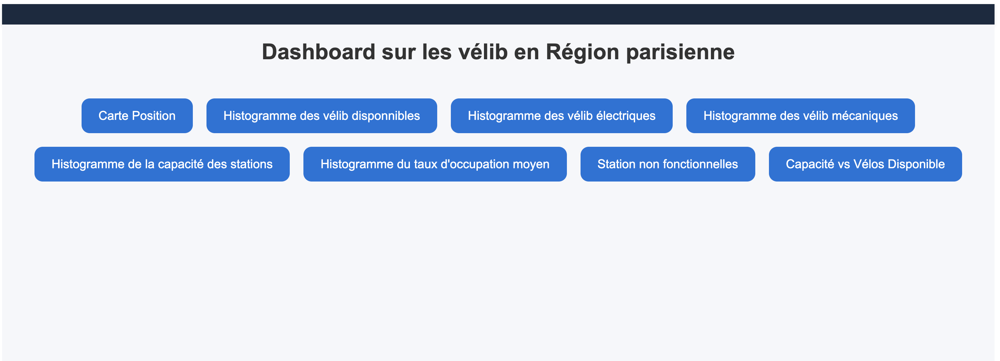
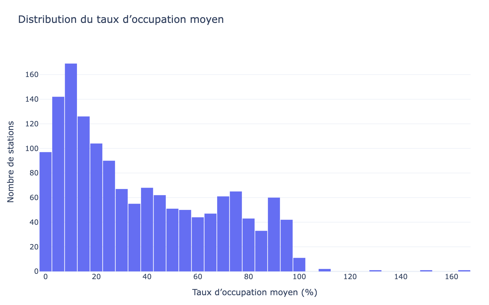

# ProjetDATA
Projet de data E4 DSIA Paris de Antoine & Soen à l'ESIEE
# 🚴‍♂️ 

## 📝 Description

Ce projet a pour objectif de visualiser et analyser l'état des stations Vélib' à Paris.Il utilise des données mises à jour régulièrement, stockées dans une base de données SQLite crée par nous , pour ensuite  générer des graphes et cartes interactives et des des disponibilités qui est mis a jour toutes les heures.

---

## ✨ Fonctionnalités Clés

* **Acquisition des Données :** Utilisation de fichiers CSV pour initialiser une base de données SQLite (`velib.db`).
* **Analyse de la Disponibilité :** Calcul du taux d'occupation, du nombre de vélos disponibles (mécaniques et électriques).
* **Visualisation Cartographique :** Génération d'une carte interactive (Folium ) (`velib_occupation_map.html`) montrant la position et le taux d'occupation des stations.
* **Visualisations Statistiques :** Création d'histogrammes dynamiques pour diverses métriques (capacité, vélos disponibles, taux d'occupation).
* **Nettoyage Automatique :** Suppression des anciennes visualisations HTML avant la génération des nouvelles.

---

## 🚀 Installation

### Prérequis

Assurez-vous d'avoir Python 3 installé.

### Environnement Python

1.  Clonez le dépôt :
    ```bash
    git clone [https://github.com/votre-nom-utilisateur/ProjetDATA.git](https://github.com/votre-nom-utilisateur/ProjetDATA.git)
    cd ProjetDATA
    ```

2.  Installez les dépendances nécessaires avec le fichier (`requirements.txt`):
    ```bash
    pip install -r requirements.txt
    ```

### Structure du Projet

Le projet suit la structure suivante :
<pre>
 ProjetDATA
├── 📁 .vscode
├── 📁 assets
│   ├── bar_stations_non_fonctionnelles.html
│   ├── hist_capacite_station.html
│   ├── hist_taux_occupation_moyen.html
│   ├── hist_velos_disponibles.html
│   ├── hist_velos_electriques.html
│   ├── hist_velos_mecaniques.html
│   ├── scatter_capacite_vs_velos_disponibles.html
│   └── velib_occupation_map.html
├── 📁 data
│   ├── 📁 cleandata
        ├──velib_disponibilite_clean.csv
│   ├── 📁 database
        ├──velib.db
│   └── 📁 rawdata
        ├──velib_disponibilite.csv
├── 📁 images
├── 📁 src
│   ├── 📁 components
        ├──__init__.py
        ├──footer.py     
        ├──navbar.py       
│   ├── 📁 pages
        ├──capacite_station.py
        ├──capacite_vs_velos_disponibles.py
        ├──carte_position.py
        ├──home.py
        ├──station_non_fonctionnelles.py
        ├──taux_occupation_moyen.py
        ├──velos_disponibles.py
        ├──velos_electriques.py
        ├──velos_mecaniques.py
│   └── 📁 utils
        ├──__init__.py
        ├──CleanData_CSV.py
        ├──Create_DataBase.py
        ├──Download_CSV.py
        ├──Histogramme.py
        ├──Map.py
        ├──velib_s.py
├── .gitignore
├── config.py
├── main.py
├── README.md
└── requirements.txt
</pre>
---

## ⚙️ Utilisation


1.  **Lancer le Dashboard :**
    ```bash
    python main.py
    ```
    Ouvrez votre navigateur et accédez à l'adresse fournie par Dash (généralement `http://127.0.0.1:8050/`).

---
**Page d'acceuil du Dashboard**


Voici la page d'acceuil de notre Dashboard ou l'on à accès au differents diagramme et de la carte.

**Exemple de Graphique**


**Exemple de conclusion sur le graphique**

On voit que le taux d'occupation varie beaucoup selon les stations. Peu de stations sont totalement pleines ce qui nous demontre l'influence des vélib dans Paris. 
_L'histogramme est interactif est permet d'etre plus précis sur les valeurs._

## 🔗 Liens Utiles

* **Source des Données :** https://www.data.gouv.fr/datasets/velib-velos-et-bornes-disponibilite-temps-reel/
* **Documentation Dash :** https://dash.plotly.com/
* **Documentation Folium :** https://python-visualization.github.io/folium/latest/


---

## ✅ Conclusions et Perspectives
Le réseau Vélib’ est trés utilisé, avec une disponibilité de vélos souvent faible.

Il existe de grosses différences selon les zones :
Dans les Arrondisments, les stations sont souvent vides.
Dans la périphérie , il y a plus de disponibilités.

Les vélos électriques sont encore moins disponibles que les mécaniques due à le forte demande.

Les stations sont de petite capacité, ce qui augmente le risque de saturation des stations.

La plupart des stations fonctionnent , donc les problèmes ne proviennent pas d’un manque de stations qui fonctionnent , mais plutôt :
de la dégradation des vélos,de la demande élevée,de la petite taille moyenne des stations.

---

## © Copyright

Je déclare sur l'honneur que le code fourni a été produit par moi/nous-même, à l'exception des lignes ci-dessous :

* **Pour chaque ligne (ou groupe de lignes) empruntée**, donner la référence de la source et une explication de la syntaxe utilisée.
* Toute ligne non déclarée ci-dessus est réputée être produite par l'auteur (ou les auteurs) du projet. L'absence ou l'omission de déclaration sera considérée comme du **plagiat**.